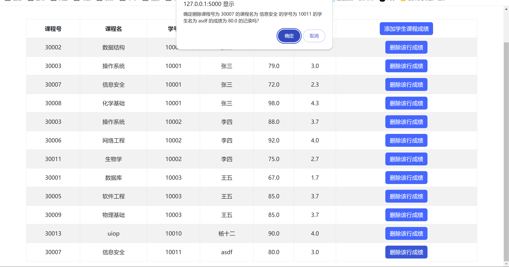

<center><h1>数据库系统及应用 课程实验报告</h1></center>

<center><h2>PB21000057 顾荣健</h2></center>

<center><h2>2024/06/05</h2></center>

## 实验题目

* **数据库系统设计与开发——学籍管理系统**

## 需求分析

本项目需要完成一个可供学生使用的学籍管理系统，需要包含如下功能：

对于学生：

* 学生查询并修改学籍基本信息，如查询学号、修改手机号，进行专业变更等；
* 查询全校排课与个人上课情况，即授课的教师、地点以及学生的课程成绩等；
* 学生查询奖惩情况：学生可以查询自己的所有奖惩情况。

对于管理员：

* 查看并修改所有学生的基本学籍信息；
* 对所有学生进行专业修改；
* 查看并修改所有课程信息，包括课程的名称、授课教师等；
* 查看并修改所有学生选课信息，并可以修改成绩，删除成绩等；
* 查看并修改所有学生的奖惩信息。

## 总体设计

系统使用BS架构实现，前端大部分基于原生js实现，小部分基于jQuery实现；后端使用Flask服务器实现。

### 系统模块结构

系统包含前端后端两大模块，前端包含页面显示、与用户交互以及与后端的数据传输；后端包含向前端传输数据、从前端获取请求以及与数据库的交互，如下图所示。


### 系统工作流程

1. 后端开启服务器后，用户访问网页[localhost:5000]()来使用该系统。
2. 用户应先根据学号注册账号，设置自己的用户名和密码。
3. 用户登录后，可以查看或修改信息，前端通过post请求将数据发送给后端。
4. 后端接收前端请求，进行相应的数据处理，包括验证身份、生成交互数据等，并与数据库进行对应的交互，得到正确的信息。
5. 后端将处理结果发送给前端，前端进行相应的展示。

### 数据库设计

#### ER图


#### 实体与属性

1. 学生：表示学生实体。包含属性：学号（主码）、姓名、性别、身份证号、手机号、民族、籍贯、学历层次。

   对于root用户而言，其有一个学号为0，但没有与之对应的学生实体。

2. 教师：表示教师实体。包含属性：教师编号（主码）、姓名、性别、身份证号、手机号、所在学院、职称。

3. 课程：表示课程实体。包含属性：课程号（主码）、课程名称、开课专业、开课学院、学分、课时、课程类型、上课时间与地点。

4. 专业：表示学生、课程所属的专业实体。包含属性：专业号（主码）、专业名称、所属院系、要求总学分。

5. 院系：表示教师所在的、专业所属的院系实体。包含属性：院系号（主码）、院系名、院长。

6. 奖惩：表示学生的奖惩实体。包含属性：奖惩编号（主码）、奖惩内容、奖励或惩罚。

#### 关系设计

1. 学生-课程的选课关系：一门课可以有多个学生，一个学生可以选多门课，因此关系为多对多关系。此外学生的课程有成绩，可作为属性。
2. 教师-课程的教授关系：一门课可以有多个教师，一名教师可以上多门课，因此关系为多对多关系。
3. 学生-专业的从属关系：一个专业下可以有多名学生，但一个学生只能有一个专业，因此关系为一对多关系。
4. 课程-专业的从属关系：一个专业下可以有多门课程，但一门课程只能由一个专业开设，因此关系为一对多关系。
5. 专业-院系的从属关系：一个院系下可以有多个专业，但一个专业只能属于一个院系，因此关系为一对多关系。
6. 教师-院系的从属关系：一个院系下可以有多名教师，但一名教师只能属于一个院系，因此关系为一对多关系。
7. 学生-奖惩的拥有关系：一名学生可以有多个奖惩情况，一个奖惩情况也可以属于多名学生，因此关系为多对多关系。

#### 模式分解

首先，ER图中的每个实体都应使用一个表来存储；对于一对一或一对多的关系，可以直接将“一”的实体主码放在“多”的表中；对于多对多的关系，需要新建一个表来表示该关系。因此基于上述的实体属性，可以得到上述ER图的模式分解：

1. 学生：增加新属性smajor，用以表示学生-专业的一对多关系；
2. 教师：增加新属性tcollege，用以表示教师-院系的一对多关系；
3. 课程：增加新属性cmajor，用以表示课程-专业的一对多关系；
4. 专业：增加新属性mcollege，用以表示专业-院系的一对多关系；
5. 增加新表：
   * 学生-课程表，用以表示学生与课程的多对多关系；
   * 教师-课程表，用以表示教师与课程的多对多关系；
   * 学生-奖惩表，用以表示学生与奖惩的多对多关系。

除此之外，上述1-4所增加的新属性还应添加外键约束，保证不会出现空指问题。

上述数据库的其他约束（如主键约束、非空约束等）在此处不在赘述，实现细节在代码中。

#### 模式分解的3-NF证明

1. 该关系模式是1-NF的，因为对于每个属性，属性值都只含有一个值；
2. 该关系模式是2-NF的，因为该关系模式中，所有的非主属性都完全函数依赖于主码；
3. 该关系模式是3-NF的，因为该关系模式中，每一个非主属性都不传递依赖于主码。

## 核心代码解析

仓库地址：https://github.com/RJ-Gu/Database_Lab

### 目录结构

```
+---database module							-- 数据库交互部分
|       calculate_student_total_gpa.sql		-- 计算学生总gpa，sql函数实现
|       database_data_init.sql				-- 数据库测试数据
|       database_init.sql					-- 数据库初始化，建表、添加约束等
|       edit_course_info.sql				-- 修改课程信息，sql存储过程+事务
|       edit_student_info.sql				-- 修改学生信息
|       insert_new_course.sql				-- 插入新课程
|       insert_new_reward_punishment.sql	-- 插入新的奖惩信息
|       insert_new_student.sql				-- 插入新学生
|       major_change.sql					-- 学生转专业
|       student_course_gpa_trigger.sql		-- 学生插入成绩时自动计算该门课程的gpa，sql触发器实现
|       user_password_init.sql				-- root用户创建
|
\---web & server							-- 前端
    |   back_end_interaction.py				-- 服务器与数据库交互，包括查询、调用存储过程等
    |   main.py								-- 服务器代码
    |
    +---static								-- 网页渲染相关静态文件
    |   |   favicon.ico						-- 图标
    |   |   function.js						-- 部分js函数
    |   |   styles.css						-- 部分使用的css样式
    |   |
    |   \---student_images					-- 保存学生上传的图片
    |           10001.jpg
    |           10007.jpg
    |           default.jpg					-- 默认使用的图片
    |
    +---templates								-- 所有的前端网页
    |       add_course.html						-- 添加课程
    |       add_reward_punishment.html			-- 添加奖惩信息
    |       add_student.html					-- 添加学生
    |       add_student_course.html				-- 添加学生选课信息
    |       add_student_reward_punishment.html	-- 添加学生奖惩信息
    |       basic_info.html						-- 学生基本信息
    |       change_major.html					-- 学生转专业
    |       course_grade_info.html				-- 查看学生选课与成绩信息
    |       course_info.html					-- 查看全部课程信息
    |       edit_course_teacher_info.html		-- 修改课程的教师信息
    |       edit_single_course_info.html		-- 修改课程的基本信息
    |       edit_single_student_info.html		-- 修改学生的基本信息
    |       login.html							-- 登录界面
    |       main_page.html						-- 主页
    |       my_course_info.html					-- 学生查看个人的选课信息
    |       register.html						-- 注册界面
    |       reward_punishment.html				-- 查看奖惩信息
    |       student_info.html					-- 查看全部学生信息
    |
    \---__pycache__
            back_end_interaction.cpython-310.pyc
```

### 服务器部分

该部分代码位于`/web & server/main.py`文件中。

服务器使用Flask实现。Flask是一个简单的python web服务器框架，通过简短的代码就可以在本地运行一个可用的web服务器。

Flask服务器新建页面的框架如下：

```python
# main.py

@app.route("页面链接", methods=["GET", "POST"])
def xxx():
    if request.method == "GET":
        # 先获取参数
        xxx = request.args.get("xxx")
        # 渲染页面
        return render_template("xxx.html", 参数列表)
    else:
        # 获取参数与表单的值
        xxx = request.args.get("xxx")
        yyy = request.form["yyy"]
        # 后端处理
        result = back_end_interaction.zzz(xxx, yyy)
        # 根据不同处理结果跳转不同页面，并进行alert提示
        if result is True:
            return """
            <script>
            alert("成功")
            window.location.href = "成功后跳转的网页+url参数";
            </script>
            """
    	else:
            return """
            <script>
            alert("失败")
            window.location.href = "失败后跳转的网页+url参数";
            </script>
            """
```

main.py文件中定义的大部分函数都使用了以上结构，不同的函数调用的参数、渲染和跳转的网页有所不同。

以添加学生函数`add_student`为例，如下所示：

```python
# main.py

@app.route('/add_student', methods=['GET', 'POST'])
def add_student():
    if request.method == 'GET':
        largest_student_id = back_end_interaction.get_largest_student_id() + 1
        full_college_major_info_list = back_end_interaction.get_full_college_major_info_list()
        full_college_major_info_list_json = json.dumps(full_college_major_info_list)
        return render_template('add_student.html', largest_student_id=largest_student_id,
                               full_college_major_info_list=full_college_major_info_list_json)
    else:
        new_student_id = request.args.get('student_id', type=int)
        new_student_name = request.form['name']
        new_student_gender = request.form['gender']
        new_student_id_card = request.form['id_card']
        new_student_phone = request.form['phone']
        new_student_ethnicity = request.form['ethnicity']
        new_student_city = request.form['city']
        new_student_education = request.form['education']
        new_college_id = request.form['college']
        new_major_id = request.form['major']
        new_student_info = {
            'id': new_student_id,
            'name': new_student_name,
            'gender': new_student_gender,
            'id_card': new_student_id_card,
            'phone': new_student_phone,
            'ethnicity': new_student_ethnicity,
            'city': new_student_city,
            'education': new_student_education,
            'college_id': new_college_id,
            'major_id': new_major_id
        }
        # print(new_student_info)
        result = back_end_interaction.add_student(new_student_info)
        if result is True:
            # 添加成功
            return """
            <script>
            alert('添加成功！');
            window.location.href = "/student_info?operator_id={}";
            </script>
            """.format(0)
        else:
            # 添加失败
            return """
            <script>
            alert('添加失败！');
            window.location.href = "/add_student?operator_id={}";
            </script>
            """.format(new_student_id)
```

可以通过上述代码看到：

* 对于GET请求，需要从后端得到的数据为：
  * 最大的学生学号，用于添加学生时自动得到新学生的学号；
  * 全部的学院与专业列表，用于添加学生时从专业列表中选择合法的学院和专业。
* 对于POST请求，通过表单的POST请求得到的信息包括学生的学号、姓名、性别等信息，将其打包为一个字典后可以交给后端进行交互，并根据结果弹出不同的提示，跳转到不同的页面。

### 前端部分

该部分代码位于`/web & server/templates`文件夹中。

在本系统中，网页的显示大部分情况下仅使用了原生html/js，少数代码用到了jQuery。此外基于Flask服务器支持Django模板，代码中也用到了大量的模板用来显示后端传送的内容。

同样以`add_student.html`为例，部分代码如下所示：

```html
<!-- add_student.html -->
<!-- head -->
<script>
    // 从后端获取的学院专业列表，初始化下拉框
    $(document).ready(function () {
        var json_string = {{ full_college_major_info_list | tojson }};
                      var full_college_major_list = JSON.parse(json_string);
    var collegeSelect = document.getElementById('collegeSelect');
    var majorSelect = document.getElementById('majorSelect');

    // 初始化学院下拉框
    for (var i = 0; i < full_college_major_list.length; i++) {
        var collegeOption = document.createElement('option');
        collegeOption.value = full_college_major_list[i].id;
        collegeOption.text = full_college_major_list[i].name;
        collegeSelect.appendChild(collegeOption);
    }

    // 学院下拉框改变时，初始化专业下拉框
    collegeSelect.addEventListener('change', function () {
        majorSelect.innerHTML = '';
        var college_id = collegeSelect.value;
        if (college_id == 0) {
            majorSelect.disabled = true;
            return;
        }
        majorSelect.disabled = false;
        var major_list = full_college_major_list.find(function (item) {
            return item.id == college_id;
        }).major;
        for (var i = 0; i < major_list.length; i++) {
            var majorOption = document.createElement('option');
            majorOption.value = major_list[i].id;
            majorOption.text = major_list[i].name;
            majorSelect.appendChild(majorOption);
        }
    });
    });

    function generate_href_and_submit() {
        var form = document.getElementsByTagName('form')[0];
        var new_student_id = document.getElementById('new_student_id').value;
        form.action = generate_href_with_operator_id('add_student', new_student_id, {{ operator_id }});
        form.submit();
    }
</script>

<!-- body -->

<form action="/add_student" method="post">
    <table class="table table-striped table-bordered">
        <thead>
            <tr>
                <th>属性</th>
                <th>值</th>
            </tr>
        </thead>
        <tbody>
            <tr>
                <td>学号</td>
                <td><input type="number" id="new_student_id" name="new_student_id" value="{{ largest_student_id }}" class="form-control"></td>
            </tr>
            <tr>
                <td>姓名</td>
                <td><input type="text" name="name" value="" class="form-control"></td>
            </tr>
                ...
        </tbody>
    </table>
    <button type="submit" value="保存" class="btn btn-primary" onclick="generate_href_and_submit()">保存</button>
</form>
```

在上述代码中，可以看到使用了`form`实现表单数据的提交，使用Django的`{{ }}`模板来填充内容，使用编写的js函数实现网页内容的改变与提交。

上述js函数在添加学生的页面中实现了如下两个功能：

* 在页面加载完成后，学生信息中的学院栏和专业栏将会自动地填充为后端数据所提供的学院和专业，并且在学院改变时，专业也会自动改为该学院下的专业，并解除不可选择状态；
* 点击“保存”按钮会自动触发`generate_href_and_submit`函数，找到页面中的表单，并生成跳转到的页面，最终提交表单。

### 服务器与数据库交互部分

该部分代码位于`/web & server/back_end_transaction.py`文件中。

python与服务器交互使用了`mysql-connector-python`库，通过这个库可以向后端发送SQL代码令其执行，并得到返回结果。

通过上述库连接SQL数据库的代码为`connect_db`函数，如下所示：

```python
# back_end_transaction.py

def connect_db():
    try:
        cnx = mysql.connector.connect(
            host='localhost',			# 主机名
            user='',					# 用户名
            password='',				# 密码
            database=''					# 数据库名称 
        )
        return cnx
    except Exception as e:
        print(e)
        return None
```

常见的与数据库交互方式包括：

* 手动编写SQL代码，使数据库执行该代码：文件中`query_db`和`modify_db`实现了该功能，调用了库函数`cursor.execute`；
* 编写SQL文件，在python中调用存储过程：文件中`call_db_proc`实现了该功能，调用了库函数`cursor.callproc`。

对应的代码如下：

```python
# back_end_transaction.py

def call_db_proc(procname: str, param_tuple: tuple):
    cnx = connect_db()
    cursor = cnx.cursor()
    try:
        cursor.callproc(procname, param_tuple)
        cnx.commit()
        cursor.close()
        cnx.close()
        return True
    except Exception as e:
        print(e)
        cursor.close()
        cnx.close()
        return False
    

def query_db(query):
    cnx = connect_db()
    cursor = cnx.cursor()
    try:
        cursor.execute(query)
        result = cursor.fetchall()
        cursor.close()
        cnx.close()
        return True, result
    except Exception as e:
        print(e)
        cursor.close()
        cnx.close()
        return False, None
```

以添加学生和查询学生奖惩情况为例，以下通过代码说明上述两种交互方式。

#### 查询学生奖惩情况——手动编写SQL代码

查询学生奖惩情况的代码如下：

```python
# back_end_transaction.py

def get_student_reward_punishment_list(student_id: int):
    if student_id != 0:
        query = ("SELECT student.sno, student.sname, reward_punish.rno, reward_punish.rcontent, reward_punish.rtype "
                 "FROM student, reward_punish, student_reward_punish "
                 "WHERE reward_punish.rno = student_reward_punish.rno "
                 "AND student.sno = student_reward_punish.sno "
                 "AND student_reward_punish.sno = {}".format(student_id))
    else:
        query = ("SELECT student.sno, student.sname, reward_punish.rno, reward_punish.rcontent, reward_punish.rtype "
                 "FROM student, reward_punish, student_reward_punish "
                 "WHERE reward_punish.rno = student_reward_punish.rno "
                 "AND student.sno = student_reward_punish.sno")
    err, result = query_db(query)
    if err is False:
        return None
    reward_punishment_list = []
    for reward_punishment_tuple in result:
        reward_punishment_dict = {
            'id': reward_punishment_tuple[0],
            'name': reward_punishment_tuple[1],
            'rno': reward_punishment_tuple[2],
            'content': reward_punishment_tuple[3],
            'type': reward_punishment_tuple[4]
        }
        reward_punishment_list.append(reward_punishment_dict)
    return reward_punishment_list
```

上述代码实现了根据学生id查询奖惩情况的功能。该方法的流程为：

1. 编写正确的SQL代码；
2. 调用库函数实现该功能；
3. 重新组织输出结果，并返回。

需要注意的是：上述代码存在两种query代码，这是因为查询奖惩信息是管理员和学生都可以进行的操作，但管理员可以查看所有学生的奖惩情况，但学生只能查看自己的。根据不同的`student_id`，查询的SQL代码也存在区别。

#### 添加学生——调用存储过程

添加学生的代码如下：

```python
# back_end_transaction.py

def add_student(new_student_info: dict):
    # 生成传输给sql的参数列表
    param_tuple = (
        new_student_info['id'], new_student_info['name'], new_student_info['gender'], new_student_info['id_card'],
        new_student_info['phone'], new_student_info['ethnicity'], new_student_info['city'],
        new_student_info['education'], new_student_info['major_id']
    )

    result = call_db_proc('insert_new_student', param_tuple)
    if result is True:
        return True
    else:
        return False
```

上述代码实现了给定学生基本信息，将新学生插入到数据库中的功能。该方法的流程为：

1. 生成正确的向存储过程输入的参数列表（即元组）；
2. 调用存储方法；
3. 根据存储方法返回的结果返回True或False。

需要注意的是：在调用存储过程时，数据库中必须首先存在该存储过程。这可以通过在workbench或命令行中直接执行对应的存储过程代码实现。

### 数据库部分

该部分代码位于`/database module`文件夹下。

这部分代码使用SQL实现，主要用于初始化数据库、填充测试数据、以及编写存储过程、函数、触发器。

#### 初始化数据库与插入测试数据

数据库的初始化要求按照给定的实体与属性、关系设计，初始化与插入测试数据的详细过程在代码中已经给出，不在此详细描述。

#### 存储过程与事务

以向student表中插入新学生为例，代码如下所示：

```sql
# insert_new_student.sql

DELIMITER //
DROP PROCEDURE IF EXISTS insert_new_student;
CREATE PROCEDURE insert_new_student(IN no INT, IN name VARCHAR(20), IN sex CHAR(2), IN id CHAR(18), IN phone CHAR(11),
                                    IN ethics VARCHAR(20), IN place VARCHAR(20), IN level VARCHAR(20), IN major INT)
BEGIN
    DECLARE flag INT DEFAULT 0;
    DECLARE CONTINUE HANDLER FOR SQLEXCEPTION SET flag = 1;

    START TRANSACTION;
    INSERT INTO student (sno, sname, ssex, sid, sphone, sethics, splace, slevel, smajor)
        VALUES (no, name, sex, id, phone, ethics, place, level, major);
    if flag = 1 THEN
        ROLLBACK;
        SELECT 'fail';
    ELSE
        COMMIT;
        SELECT 'success';
    end if;
END //
DELIMITER ;
```

在设计存储过程时，有以下几点需要注意：

1. 在创建存储过程之前，需要将重名的存储过程删除，防止重复添加；
2. 需要在事务开始之前添加flag变量作为标识，并在最后通过判断出错选择commit或rollback。

#### 触发器

本项目中的触发器是通过插入学生成绩自动计算GPA实现的。代码如下所示：

```sql
# student_course_gpa_trigger.sql

DELIMITER //
DROP TRIGGER IF EXISTS student_course_gpa_trigger;
CREATE TRIGGER student_course_gpa_trigger BEFORE INSERT ON student_course FOR EACH ROW
BEGIN
    DECLARE gpa FLOAT;
    IF NEW.grade is NULL THEN
        SET gpa = NULL;
    ELSEIF NEW.grade >= 95 THEN
        SET gpa = 4.3;
    ...
    ELSE
        SET gpa = 0.0;
    END IF;
    SET NEW.gpa = gpa;
    END //
DELIMITER ;
```

代码中，`BEFORE INSERT`说明该触发器在插入行之前触发；当插入新行时，给定了成绩`grade`，则通过代码自动换算为GPA，并填充新行的`GPA`属性，然后再插入表项。

#### 函数

本项目中的函数是通过计算学生加权GPA实现的。代码如下所示：

```sql
# calculate_student_total_gpa.sql

DELIMITER //
DROP FUNCTION IF EXISTS calculate_student_total_gpa;
CREATE FUNCTION calculate_student_total_gpa(sno INT)
RETURNS FLOAT
READS SQL DATA
BEGIN
    DECLARE total_credits FLOAT;
    DECLARE weighted_points FLOAT;
    DECLARE total_gpa FLOAT;

    # 给定学号，计算学生上课的总学分
    SELECT SUM(c.ccredit)
    INTO total_credits
    FROM course c
    INNER JOIN student_course sc ON c.cno = sc.cno
    WHERE sc.sno = sno;

    # 计算学生上课学分与gpa乘积
    SELECT SUM(c.ccredit * sc.gpa)
    INTO weighted_points
    FROM course c
    INNER JOIN student_course sc ON c.cno = sc.cno
    WHERE sc.sno = sno;

    # 计算学生的加权gpa
    IF total_credits > 0 THEN
        SET total_gpa = weighted_points / total_credits;
    ELSE
        SET total_gpa = 0;
    END IF;

    RETURN total_gpa;

END //
DELIMITER ;
```

该函数通过计算学生上课的总学分以及学分与GPA乘积，最后将二者相除计算得到加权GPA。

## 实验与测试

### 依赖库

python库依赖`Flask`与`mysql-connector-python`库，已在`requirements.txt`中给出，通过`pip install -r requirements.txt`即可安装。

### 部署

进入`web & server`文件夹，运行：

```shell
python main.py
```

即可运行该程序。

运行程序提示：`Running on http://127.0.0.1:5000`，即前端运行在了[localhost:5000]()上。访问网页，就可以看到如下的登陆界面，证明项目部署成功：


### 测试功能

#### 注册与登录

新用户没有账号，需要首先注册账号。点击注册，进入注册页面，输入用户名、密码以及学号即可注册成功。

例如使用学号10001注册并登录，即可进入如下页面，说明用户已经进入了系统。


#### 学生用户功能测试

学生用户可以查看与自己相关的个人信息，包括基本信息、全部课程、个人成绩以及奖惩情况。学生还可以进行个人基本信息的修改，以及转专业功能。部分功能如下几张图所示：

* 查看个人基本信息：

  

* 查看个人课程信息：

  

* 转专业申请：

  

#### 管理员用户功能测试

使用用户名root，密码root登录即可进入管理员界面，如下图所示。


管理员用户可以查看并修改全部学生信息，查看并修改全部课程信息，查看、增加、删除学生选课信息与奖惩信息。

几个典型功能如下图所示：

* 查询特定学号的学生基本信息：

  

* 添加学生：

  

* 修改课程基本信息：

  

* 修改课程教师信息：

  

* 删除学生课程成绩：

  

* 给学生添加奖惩信息：

  

#### 特殊功能演示

1. 存储过程：如代码解析时所述，添加学生功能就是使用存储过程实现的，因此能够添加学生就证明存储过程实现正确。
2. 触发器与函数：本项目中学生计算单门课程GPA与总的加权GPA就是使用触发器与函数实现的，在学生用户查看所选课程中已经能看到这两个功能正确实现。
3. 文件管理：本项目中文件管理体现在学生的照片中。学生可以上传自己的照片，管理员可以修改所有学生的照片，这就完成了对照片的管理。
4. 增删改查：在管理员界面中，管理员可以进行如下操作：
   * 增：添加学生、添加课程、添加奖惩信息等；
   * 删：删除学生课程成绩、删除学生奖惩信息等；
   * 改：修改学生基本信息、修改课程教师信息等；
   * 查：根据学号查询学生基本信息等。

## 参考

Flask: https://flask.palletsprojects.com/en/3.0.x/

Bootstrap: https://getbootstrap.com/

jQuery: https://jquery.com/
