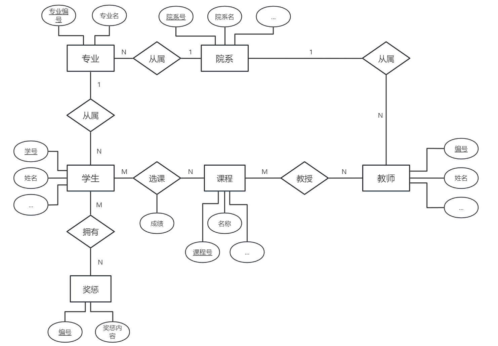

# 数据库实验 需求分析&ER图

## PB21000057 顾荣健

本实验的选题是：**学籍管理系统**。

## 需求分析说明

### 项目功能

本项目需要完成一个可供学生使用的学籍管理系统，需要包含如下功能：

* 学生查询并修改学籍基本信息，如查询学号、手机号，专业变更等；
* 查询全校排课与个人上课情况，即授课的教师、地点以及学生的课程成绩等；
* 学生查询奖惩情况：学生可以查询自己的所有奖惩情况。

### 实体及属性

1. 学生：表示学生实体。包含属性：学号（主码）、姓名、性别、身份证号、手机号、民族、籍贯、学历层次。
2. 教师：表示教师实体。包含属性：教师编号（主码）、姓名、性别、身份证号、手机号、所在学院、职称。
3. 课程：表示课程实体。包含属性：课程号（主码）、课程名称、开课专业、开课学院、学分、课时、课程类型、上课时间与地点。
4. 专业：表示学生所在的专业实体。包含属性：专业号（主码）、专业名称、所属院系、要求总学分。
5. 院系：表示教师所在的、专业所属的院系实体。包含属性：院系号（主码）、院系名、院长。
6. 奖惩：表示学生的奖惩实体。包含属性：奖惩编号（主码）、奖惩内容、奖励或惩罚。

### 关系设计

1. 学生-课程的选课关系：一门课可以有多个学生，一个学生可以选多门课，因此关系为多对多关系。此外学生的课程有成绩，可作为属性。
2. 教师-课程的教授关系：一门课可以有多个教师，一名教师可以上多门课，因此关系为多对多关系。
3. 学生-专业的从属关系：一个专业下可以有多名学生，但一个学生只能有一个专业，因此关系为一对多关系。
4. 专业-院系的从属关系：一个院系下可以有多个专业，但一个专业只能属于一个院系，因此关系为一对多关系。
5. 教师-院系的从属关系：一个院系下可以有多名教师，但一名教师只能属于一个院系，因此关系为一对多关系。
6. 学生-奖惩的拥有关系：一名学生可以有多个奖惩情况，一个奖惩情况也可以属于多名学生，因此关系为多对多关系。

## ER图

